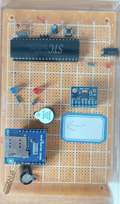

# Version1.0
---

This device can detect fallings. It mainly consists of 3 parts, the SCM (for control of the whole system), the Three-dimensional sensor(for detecting the unusual accelaration for body in three dimensions), the TCP part(which helps sending the alarming message to the phones).

