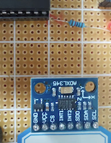
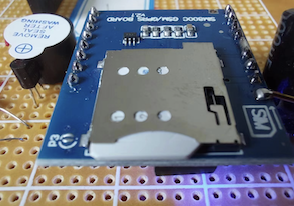
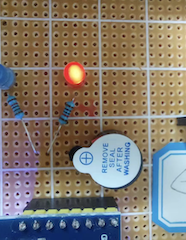

# Version1.0
---

This device can detect fallings. It mainly consists of 3 parts, the SCM (for control of the whole system), 

the Three-dimensional sensor(for detecting the unusual accelaration for body in three dimensions), 

the TCP part(which helps sending the alarming message to the phones).

notice：

* If you see the blue light shining, it works.
* The SIM card should be inserted correctly as the drawing showed on the part

* When the blue light is on, the system is working well
* When the red light is on, it means falling is detected, and the buzzer will ring at the same time.
* After several seconds, a falling-detection message will be sended to the appointed phone.
* If there is no issue，the user can press the black button to stop the alarming.

